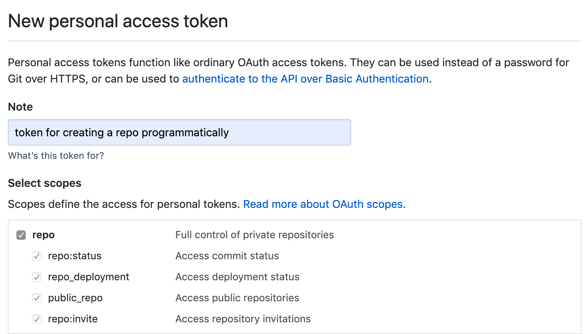

# Project Template

Structure template for computational research project

## Inspiration

[Fantastic Work by Albert Henry](https://github.com/alhenry/project-template)

## Pre-requisites

1. [python 3](https://docs.python.org/3/using/index.html)
2. [cookiecutter](https://cookiecutter.readthedocs.io/en/1.7.0/installation.html)
3. [git](https://git-scm.com/book/en/v2/Getting-Started-Installing-Git)
4. [GitHub account](https://help.github.com/en/articles/signing-up-for-a-new-github-account)

## Recommended Workflow

### Initial set up

1. Prepare the pre-requisites softwares and accounts above
2. Generate a new [GitHub personal access token](https://github.com/settings/tokens/new), fill in the **Note** field and tick **repo** box under **Select scopes**, copy the generated token
   

### Set up local project directory and GitHub

1. Open Command Line Interface (e.g. Terminal in Mac)
2. Change directory to parent project directory

   `cd my_directory`
3. Run `cookiecutter` pointing to project template git repo

   `cookiecutter https://github.com/alhenry/project-template.git`
4. When prompted, enter the project title, project directory name, GitHub username,  GitHub repository name (make sure name is available), and [GitHub personal access token](#initial-set-up). Leave blank to use the default value (shown in square bracket).


## Directory structure

The default project structure is outlined below:

```
./
├── .git/
|
├── admin/
|   └── meeting_notes.csv
|
├── data/
|   ├── iris.tsv
|   └── mtcars.csv
|   
├── scripts/
|   ├── s01_data_generation.sh
|   |── s02.1_calculate_desc_stats_table1.R
|   └── s02.2_figure1.ipynb
|
├── exploratory/
|
├── results/
|   ├── table1.tsv
|   └── figure1.png
|
├── writing/
|   ├── main_text.doc
|   ├── supplementary_table.xls
|   └── analysis_plan.doc
|
└── ...
```

#### Note

* **.git** - hidden folder for git version control
* **admin** - Admin documents, e.g. meeting notes, applications, ethical approvals, MTA
* **data** - Read only data files used as input for analysis and results
* **scripts** - Analysis scripts
* **exploratory** - Scratch space for temporary output files / exploratory data analysis generated as part of the analysis, can be deleted before archiving
* **results** - output of data analysis e.g. tables, figures, jupyter notebook
* **writing** - Analysis write ups, subfolders can be created specifically for early analysis drafts and later on manuscript drafts and final editions ready for submission to specific journals (this can also include reviewer comments and reply)


## References

**File organization**

- [A Quick Guide to Organizing Computational Biology Projects](https://journals.plos.org/ploscompbiol/article?id=10.1371/journal.pcbi.1000424)
- [MIT Comm Kit - File Structure](https://mitcommlab.mit.edu/broad/commkit/file-structure/)
- [The Turing Way - Research Data Management](https://the-turing-way.netlify.com/rdm/rdm.html)

**Coding style**

- General recommendations: [MIT Comm Kit - Coding and Comment Style](https://mitcommlab.mit.edu/broad/commkit/coding-and-comment-style/)
- Python: [Google Python Style Guide](https://google.github.io/styleguide/pyguide.html)
- R: [tydyverse style guide](https://style.tidyverse.org/)

**Other template**

- [Cookiecutter Data Science](https://drivendata.github.io/cookiecutter-data-science/)
- [R ProjectTemplate](http://projecttemplate.net/index.html)
